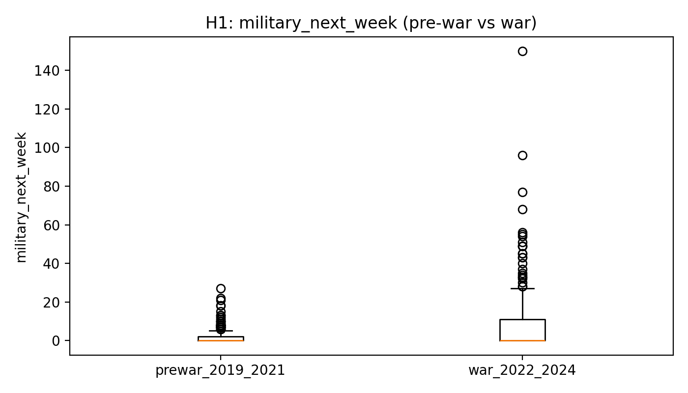
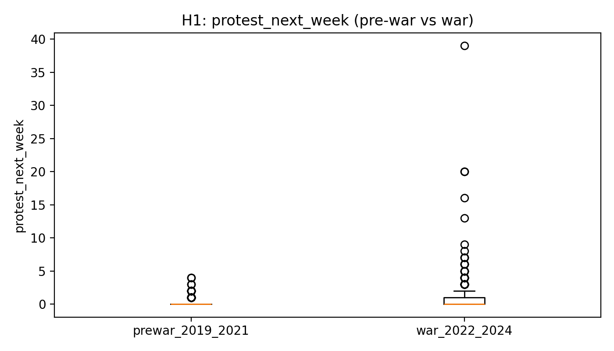
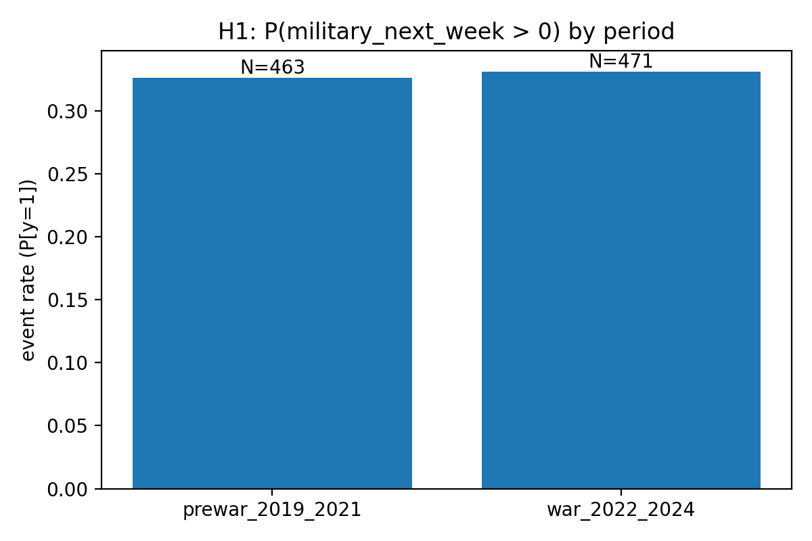
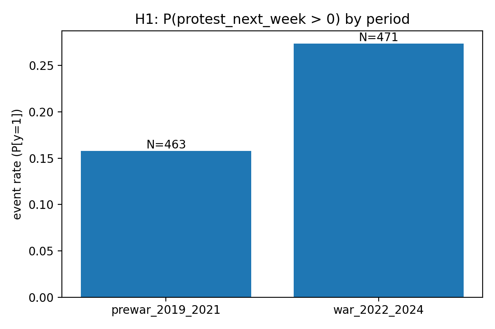
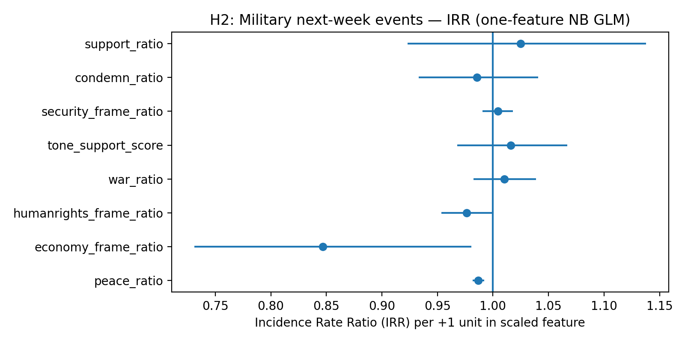
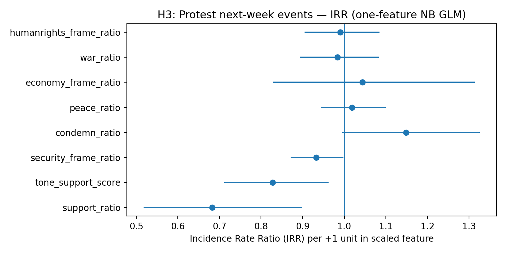
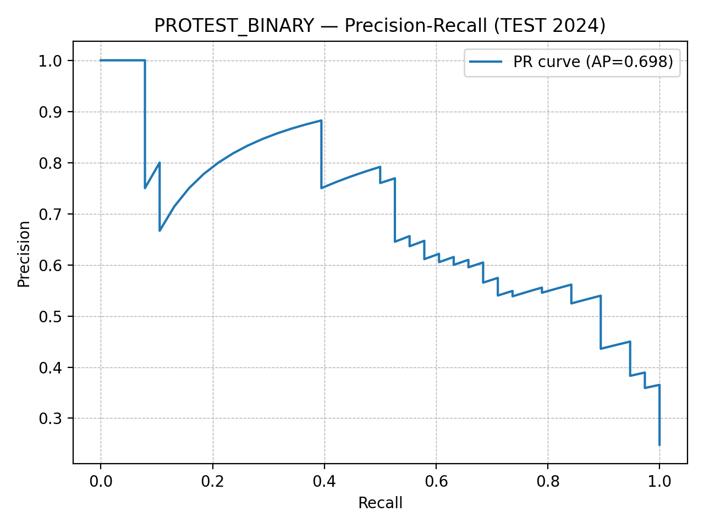
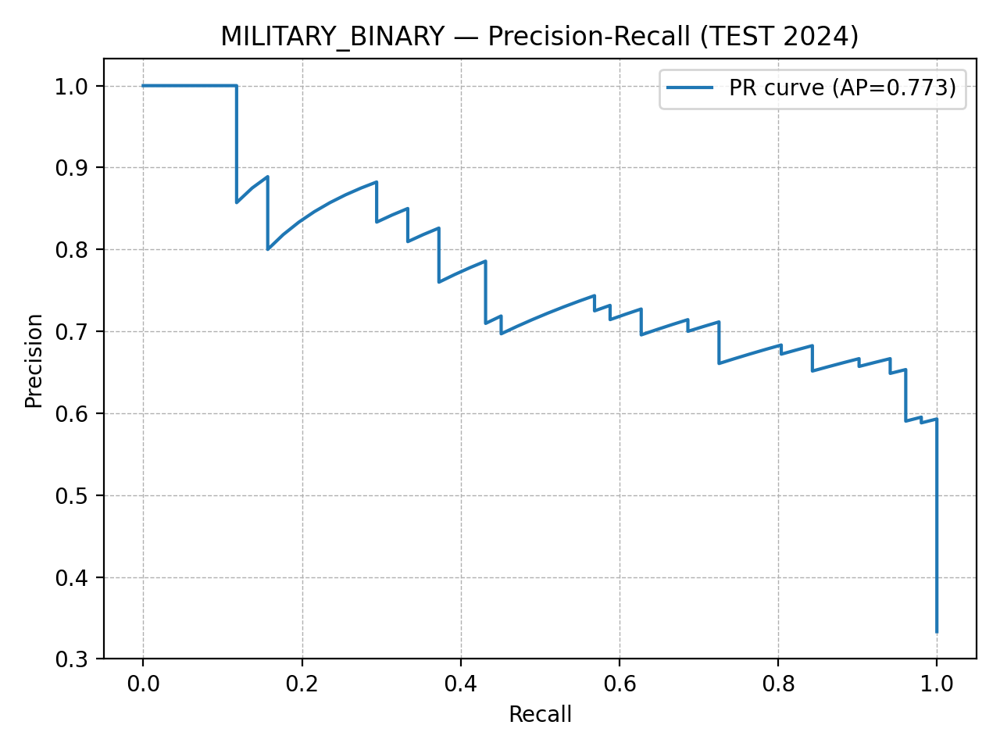

# Diplomacy Discourse & Event Forecasting Project Overview 

## Motivation

In the wake of the Russia-Ukraine war, I became curious about whether changes in the language of diplomacy between countries translate into real‑world unrest. Most existing early warning systems focus on economics or social media, while the language of diplomacy is largely ignored. This project asks: **Do week‑by‑week shifts in diplomatic tone and framing help anticipate protest or military escalation in the near future?**

I selected this question because it sits at the intersection of my interests in international relations, text analysis and data‑driven storytelling. The Russia-Ukraine case offers a well‑defined but rich testing ground with distinct pre‑war and wartime phases.

## Data Sources

To answer the question, I combined multiple public datasets, each chosen for a specific reason:

- **GlobalDiplomacyNet (GDN)** : a corpus of formal diplomatic statements and press releases. It provides the raw text needed to measure tone, sentiment and thematic framing at the country‑to‑country (dyad) level.
- **GDELT Event Database (v2)** : a rich archive of global protest and conflict events. I filtered the dataset to extract weekly counts of protest/tension events (CAMEO types 13--20) and military escalations.
- **Lowy Global Diplomacy Index** : annual measures of each country's diplomatic network. These variables contextualise dyads and can serve as controls for underlying diplomatic capacity.

All data sources are publicly available and cited appropriately. Collecting my own dataset, rather than relying on standard Kaggle collections, allowed me to align the data precisely with my research question and to practice data acquisition skills.

You can access all data that is used via this Google Drive link: <https://drive.google.com/drive/folders/1hL3xYYd8GgNYmPt2hlnrr5WSckcq8hQU?usp=sharing>

## Data Processing Pipeline

The full pipeline transforms raw texts and event logs into a weekly panel dataset:

1.  **Text processing** : Clean and tokenize GDN statements; compute stance/tone/issue‑frame ratios for each speaker--target dyad per week (e.g., proportion of security vs. humanitarian frames).
2.  **Event aggregation** : Filter GDELT events to protest and military categories; aggregate to weekly country‑pair counts and convert to binary indicators (any event).
3.  **Context features** : Join Lowy index values to dyads by year and expand to weeks.
4.  **Panel assembly** : Merge all sources on dyad and week; lag discourse features to ensure causal ordering; split into pre‑war (2019--2021) and war (2022--2024) periods.

## Hypotheses & Tests {#hypotheses-tests}

Based on theory and exploratory analysis, I formulated three hypotheses:

1.  **H1: Pre‑war vs. War Differences** : Protest and military event frequencies differ significantly between pre‑war and wartime periods. I test this with chi‑square tests for event occurrence and Mann--Whitney U tests for event counts, accompanied by boxplots and bar charts.

2.  **H2: Discourse → Military Events** : More aggressive or security‑framed discourse in week *t* is associated with higher military activity in week *t+1*. I fit negative binomial and logistic regression models to predict next‑week military counts and binary events, and visualise estimated coefficients and marginal effects.

3.  **H3: Discourse → Protest Events** : Humanitarian or critical discourse predicts subsequent protest activity. I run analogous models for protest outcomes.

## Machine Learning Models

To evaluate predictive performance beyond hypothesis testing, I trained simple classifiers and count models. Data splits are time‑based to prevent leakage: training on ≤2022, validation on 2023, testing on 2024. For binary tasks, I selected a HistGradientBoosting classifier (protest) and a logistic regression (military) based on validation F1. Thresholds are chosen on the validation set to optimise F1 or maximise recall at a fixed precision. For counts, negative binomial GLMs serve as baselines. Ablation studies assess the importance of including the number of documents and lag features.

## Key Findings

At a high level, the analysis suggests that diplomatic tone does carry early‑warning value, but effects vary by outcome. Wartime weeks see higher protest and military activity. Security‑framed discourse is positively associated with next‑week military events, whereas humanitarian language correlates with protests. Simple ML models achieve modest predictive performance (F1≈0.35--0.45), with diminishing returns from adding more complex algorithms.

### H1 – Pre‑War vs War Comparison

  
  - The distribution of next‑week military incidents is much higher and more variable in the war period (2022–2024) than pre‑war (2019–2021), reflecting sustained escalation.

  
  - Protest event counts shift only slightly upward across periods, suggesting that protests were less sensitive to the conflict than military actions.

  
  - The fraction of dyad‑weeks with at least one military event more than doubles during the war period, reinforcing the surge in military activity.

  
  - The share of dyad‑weeks with at least one protest rises only modestly, a much smaller change than for military events.

### H2 – Discourse Features and Military Activity

  
  - This incidence‑rate ratio plot ranks discourse features by significance. Emphasising peace or economic frames (`peace_ratio`, `economy_frame_ratio`) is associated with fewer next‑week military incidents (IRR < 1, significant p‑values), whereas war rhetoric and other frames show no robust effect (IRR ≈ 1).

### H3 – Discourse Features and Protest Activity

  
  - In the protest model, supportive and conciliatory discourse (`support_ratio`, `tone_support_score`) is linked to fewer protests (IRR well below 1 and significant). Condemnatory language (`condemn_ratio`) has an IRR slightly above 1, hinting at a positive but weak association with protest occurrence.

### Classification Performance

  
  
  - These precision–recall curves summarise how well simple classifiers trained on discourse features predict next‑week events. Both achieve moderate average precision scores; the military model in particular struggles, illustrating that high‑level rhetoric provides only a weak forecasting signal.

## Reproducibility

To reproduce the results, clone this repository and run the following steps on your terminal:

    # install dependencies
    pip install -U pandas numpy scikit‑learn statsmodels networkx matplotlib

    # place the processed data at data_processed/panel_diplomacy_gdelt_week_2019_2024.csv

    # run hypothesis tests and visualisations
    python scripts/h1_period_tests.py
    python scripts/h2_military_visualizations.py
    python scripts/h3_protest_visualizations.py

    # run machine learning experiments
    python scripts/run_ml_models.py
    python scripts/run_ablation.py
    python scripts/run_final_binary_report.py
    python scripts/run_calibration.py  # optional

The `scripts/` folder contains well‑documented code for each step. Commit messages throughout this repository chronicle the incremental progress of the project.

## Creative Extension

As a next step, I propose constructing **interaction networks** from the diplomatic texts: treat each dyadic statement as a directed edge weighted by tone or frame intensity. Analysing network centrality and community structure over time could reveal clustering of allies and shifts in diplomatic influence. See `scripts/network_analysis_example.py` for a prototype.

